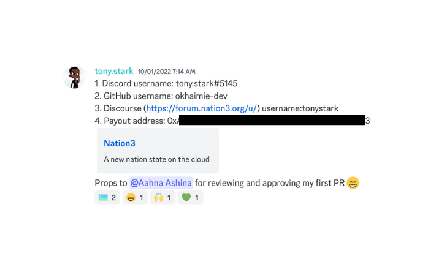

# 🎇 Obtaining reputation

We have a system called NationCred that aggregates contributions to Nation3 across multiple channels like GitHub, Discord, Discourse (the Nation3 forum) and other channels.

NationCred is available to Nation3 citizens, and there are weekly payouts in $NATION to citizens who contribute.

To become eligible for NationCred, head to the _#🎗-nationcred_ channel on [Discord](https://n3.gg/discord). Keep in mind it's only available to citizens, so you'll need to use the _#🤖-guild-join_ channel first to authenticate as a citizen.

<figure><figcaption></figcaption></figure>
