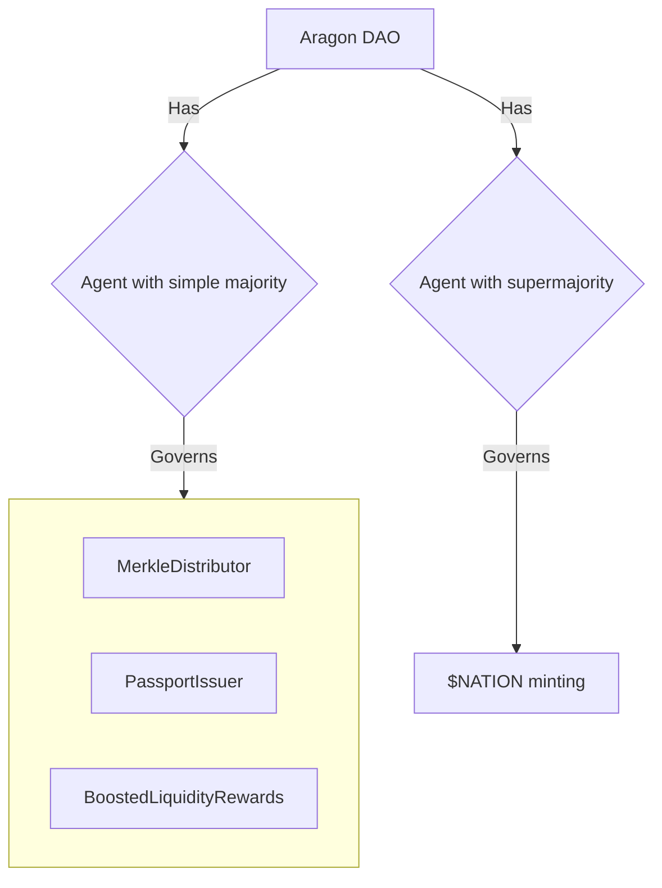

# ⛓ DAO


Don't know what a DAO is? [Read this first](https://blog.aragon.org/what-is-a-dao/).


The Nation3 DAO is an [Aragon DAO](https://aragon.org/) with:

* Two [Agent app instances](https://aragon.org/agent): One — called just Agent — is meant to hold funds and control non-sensitive actions, and the other one — called Critical Agent — is meant to control extraordinary or sensitive actions, such as minting new $NATION or making significant changes to the DAO itself.
* Two Voting app instances: One per Agent app. The first one is governed by $veNATION holders with simple majority voting, and the other with supermajority (66%) and a minimum quorum (20%). The latter is the one used to decide on sensitive actions. More on its parameters can be read on [Nation3's governance process](https://github.com/nation3/gov#proposalswith-critical-impact).

Here's a breakdown with the permission structure:

.png>)

.png>)

### What's currently governed by the DAO[​](https://wiki.nation3.org/dao/#whats-currently-governed-by-the-dao) 

* Via Agent:
  * Its treasury, consisting of most of $NATION's initial supply.
  * The [`PassportIssuer`](https://etherscan.io/address/0x279c0b6bfCBBA977eaF4ad1B2FFe3C208aa068aC) smart contract that is used to mint and burn passports.
* Via Critical Agent:
  * The $NATION token (the DAO can decide on the minting schedule, or cap the supply).
  * Its own voting parameters and other key DAO parameters.

