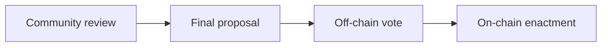
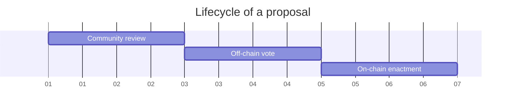

# 🗳 Governance process

This document outlines the governance process that the Nation3 citizens, the [guardian-guild.md](../guilds/guardian-guild.md "mention") and the proposers must follow to engage with Nation3 governance.

### Kinds of proposals

* **Meta**: Proposal that modifies the current governance process (`specs/N3GOV-v1.d.ts` and `GOVERNANCE.md`).
* **Proclamation**: Proposal for the Nation3 DAO to adopt a statement.
  * Since multiple choices would be written in English and not encoded, this is the only kind of proposal on Snapshot that can use other voting systems other than _Single Choice_.
* **Expense**: Proposal to transfer an ERC20 token outside of the Nation3 DAO's treasury, with the expectation that it flows outside of its control.
* **Parameter change**: Proposal to perform a parameter change in one of the contracts controlled by the Nation3 DAO.
* **Treasury management proposal**: Proposal to perform an on-chain treasury management operation.
* **Custodial treasury management proposal**: Proposal to perform a treasury management operation, with the Nation3 DAO keeping the legitimate ownership over the assets but holding them through a third-party entity.

### Stages of a proposal

1. **Community review**: The community provides feedback on a published proposal for the proposer to consider. The proposer must explain how the proposal helps Nation3 advance its North Star metrics. After the minimum duration required for this stage, the proposer can freeze their proposal, advancing it to the next stage. After freeze, any further modifications to the proposal require restarting the process.
   * **Duration**: >48h.
   * **Platform**: [Forum](https://forum.nation3.org).
2. **Off-chain vote**: Citizens can vote. The [guardian-guild.md](../guilds/guardian-guild.md "mention") is responsible for creating the proposal on Snapshot.
   * **Duration**: 48h.
   * **Platform**: [Snapshot](https://snapshot.org/#/nation3.eth).
   * **Census**: All Nation3 citizens.
   * **Voting weight**: Token-weighted by $veNATION balance.
   * **Voting system**:
     * **Proclamation proposals**: _Single Choice_, _Ranked Choice_ or _Weighted_ as chosen by the proposer.
     * **All other kinds of proposals**: _Single Choice_.
   * **Voting threshold**: Simple majority.
3. **On-chain enactment**: $veNATION holders can ratify the proposal. The [guardian-guild.md](../guilds/guardian-guild.md "mention") is responsible for creating the proposal on Aragon.
   * **Duration**: 48h.
   * **Platform**: [Aragon](https://client.aragon.org/#/nation3/0x92462953792d3e84af56edfc74d93e5885d38cc0/).
   * **Census**: All $veNATION holders.
   * **Voting weight**: Token-weighted by $veNATION balance.
   * **Voting system**: Binary (approve/reject).
   * **Voting threshold**: Simple majority.

Census and voting weights are determined at the time of vote creation, both for the Nation3 space on Snapshot and the Nation3 DAO on Aragon. The Nation3 DAO, Nation3 passports and $veNATION are currently only on Ethereum.

### Submitting a proposal

1. Once you are ready to submit a formal proposal, go to the [Proposal Generator](https://gov.nation3.org/proposals/create) to generate an encoded version. Proposals need to adhere to the governance spec.
2. [Open a pull request](https://github.com/nation3/gov-proposals/pull/new) in the `gov-proposals` repo adding the proposal as `N3GOV-X.json`. Link the pull request at the end of your forum post.
3. Modify the proposal based on feedback, both in the forum and in the pull request.
4. Once the feedback period ends, you can tag it as `frozen` on GitHub.
5. A bot will automatically allow you to merge it after checking:
   * All data types match the spec.
   * The pull request is at least 48h old.
6. The [guardian-guild.md](../guilds/guardian-guild.md "mention") multisig creates the vote on Snapshot. The vote must start with `N3GOV-ID:` (where ID is the proposal's ID) followed by the title of the proposal's discussion.
7. If the Snapshot vote passed, the [guardian-guild.md](../guilds/guardian-guild.md "mention") multisig creates the vote on Aragon.

### Proposals with critical impact

The Nation3 DAO has an Agent app instance (called _Critical Agent_) governed by a Voting app with the following voting parameters:

* **Duration**: 168h (one full week).
* **Platform**: [Aragon](https://client.aragon.org/#/nation3/0xfbad11cb39f62cf5248b2d85e3fb36df99df758e/).
* **Census**: All $veNATION holders.
* **Voting weight**: Token-weighted by $veNATION balance.
* **Voting system**: Binary (yes/no).
* **Voting threshold**: >66% (supermajority) approval threshold with >20% participation rate.

Any proposal which would trigger a transaction from the _Critical Agent_ app on the Nation3 DAO follows the same governance process as standard proposals, but instead of 48h for each step in the process, it's 168h (a full week).

### Who can create votes

The [guardian-guild.md](../guilds/guardian-guild.md "mention") multisig has permission to create votes, both in the Nation3 space on Snapshot and the Nation3 [dao.md](dao.md "mention") on Aragon.

The Nation3 [dao.md](dao.md "mention") can request changes in the signers and signing threshold of the [guardian-guild.md](../guilds/guardian-guild.md "mention") multisig by passing a _Proclamation_ proposal.

As a backup mechanism in case of [guardian-guild.md](../guilds/guardian-guild.md "mention") multisig malfunction, the [supreme-court.md](supreme-court.md "mention") multisig can create votes on Aragon. The Voting app installed on such DAO is configured with the exact same parameters as the _Critical Agent_ app, with the exception of any $veNATION holder being able to create votes on it.
