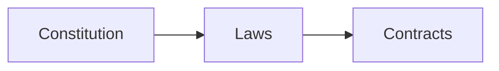
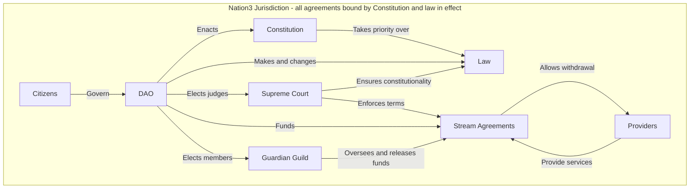

# 🌐 Overview

Nation3 is its own jurisdiction because it has the **power to create and enforce law**.

Traditionally, nation states enforce law within their physical borders (their land). But Nation3 enforces law within its virtual borders, making it the **first Internet jurisdiction**.&#x20;

The idea is simple: people can enter legal agreements over the Internet, secured by the Nation3 system of law. In case one of the parties breaches the agreement, they can **open a dispute** and take them to court in Nation3.

## Features

* **Internet-native**: No need to print, fax, pigeon or take a plane to attend a hearing. No need to wait years for a resolution.
* **Professional judges**: The [Nation3 DAO](dao.md) elects vetted professionals to resolve disputes. Judges have skin in the game and are incentivized to make fair rulings.
* **Limited liability**: In Nation3, each party entering an agreement deposits crypto as collateral — the maximum amount they can be liable for, in case of breach. No surprises.
* **Checks and balances**: The [Nation3 Constitution](constitution.md) lays out the mechanisms for law creation and the separation of powers between the judiciary, the legislative and the executive.
* **High legal standards**: In Nation3 it's unconstitutional to pass law with retroactive effect. Nation3 also adheres to the Universal Declaration of Human Rights.
* **Encrypted and private**: In case of dispute, all communications between the parties and the judges are end-to-end encrypted. And, by law, all evidence must remain private.

## Building blocks

In order for Nation3 to create and enforce law, the following building blocks are required:

* ****[**Constitution**](constitution.md): A fundamental document outlining the powers of the Nation3 state, its governance and its checks and balances.
* **Laws**: The laws to be enforced within the Nation3 jurisdiction.
* **Contracts**: The contracts entered by the Nation3 DAO with key parties (e.g. judges).

And the following stakeholders:

* **Citizens**: Ultimately govern Nation3 via the Nation3 DAO.
* **Judges**: Resolve disputes. Elected by the Nation3 DAO.
* **Guardians**: Oversee the work that guild/contractors carry out for the Nation3 DAO. Elected by the Nation3 DAO.

