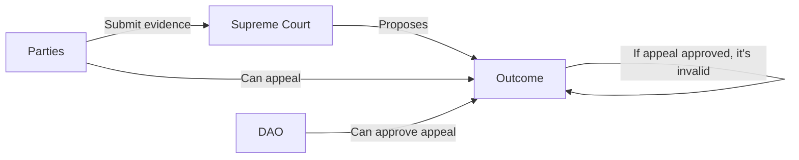

# ⚖ Supreme Court

The Supreme Court is the supreme judiciary power within Nation3.

It is composed of judges who are legal professionals, elected by the Nation3 DAO.

Its role is to resolve disputes by:

* Reading the agreement's terms.
* Reviewing any other evidence submitted by the parties of an agreement.
* Submitting a new fair financial outcome based on the law in effect and their judgement.

This is a chart describing the Supreme Court formation:

This is a chart describing the dispute resolution flow:

If the appeal is approved, the Supreme Court must propose a new outcome to resolve the dispute.

## Current judges

<table data-view="cards"><thead><tr><th></th><th></th><th data-hidden data-card-cover data-type="files"></th><th data-hidden data-card-target data-type="content-ref"></th></tr></thead><tbody><tr><td><h3>Matt Blaine</h3></td><td>Attorney based out of Monmouth County, New Jersey, in the United States. Practicing for nearly 14 years, focusing on complex commercial litigation — including extensive arbitration experience.</td><td><a href="../.gitbook/assets/Matthew-Blaine-Esq.-scaled (1).jpg">Matthew-Blaine-Esq.-scaled (1).jpg</a></td><td><a href="https://forum.nation3.org/t/submission-of-candidacy-matthew-matt-blaine/881">https://forum.nation3.org/t/submission-of-candidacy-matthew-matt-blaine/881</a></td></tr><tr><td><h3>Jose Nuno</h3></td><td>
International tax and tech lawyer since 2001, focused in crypto law since 2016. 

Deeply engaged with different web3 projects, such as Aragon, OlympusDAO, Molecule, Bio.xyz, LabDAO, ValleyDAO.
</td><td><a href="../.gitbook/assets/1516849127890 (1).jpeg">1516849127890 (1).jpeg</a></td><td><a href="https://forum.nation3.org/t/submission-of-candidacy-jose-nuno/849">https://forum.nation3.org/t/submission-of-candidacy-jose-nuno/849</a></td></tr><tr><td><h3>Gianluca Cattin</h3></td><td>I’ve participated in multiple arbitration courts and Model United Nations conferences. Previously led Curia — LexDAO’s on-chain ADR project.</td><td><a href="../.gitbook/assets/1601140646359.jpeg">1601140646359.jpeg</a></td><td><a href="https://forum.nation3.org/t/submission-of-candidacy-gianluca-cattin/841">https://forum.nation3.org/t/submission-of-candidacy-gianluca-cattin/841</a></td></tr><tr><td><h3>Eric Hill</h3></td><td>
Canadian licensed lawyer and certified negotiator. Focusing on corporate and employment law, banking litigation and business disputes. 

General Counsel at Lido, member of the advisory committee to the UK law commission on law reform for DAOs.
</td><td><a href="../.gitbook/assets/Eric-Hill.jpeg">Eric-Hill.jpeg</a></td><td><a href="https://forum.nation3.org/t/submission-e-hill/845">https://forum.nation3.org/t/submission-e-hill/845</a></td></tr><tr><td><h3>Diana Zaman</h3></td><td>Experienced working with German courts and in migration and criminal law. Worked at one of Germany’s top corporate law firms. Member of Surge DAO.</td><td><a href="../.gitbook/assets/ZmlsZTovLy9Vc2Vycy9ndWVzdC9MaWJyYXJ5L0FwcGxpY2F0aW9uJTIwU3VwcG9ydC9qYWNrL3RlbGVncmFtXzRjNWNmMTMyMTZlZWViODFhNzJhZWNmNWFmNGYyN2JkL21lZGlhLzExMDQ5OTkuanBn.jpeg">ZmlsZTovLy9Vc2Vycy9ndWVzdC9MaWJyYXJ5L0FwcGxpY2F0aW9uJTIwU3VwcG9ydC9qYWNrL3RlbGVncmFtXzRjNWNmMTMyMTZlZWViODFhNzJhZWNmNWFmNGYyN2JkL21lZGlhLzExMDQ5OTkuanBn.jpeg</a></td><td><a href="https://forum.nation3.org/t/submission-of-candidacy-d-zaman/853">https://forum.nation3.org/t/submission-of-candidacy-d-zaman/853</a></td></tr></tbody></table>

## Requirements to be a judge

Although not written in law, these are the advisable requirements to become a judge:

* Have a full professional proficiency in English.
* Be a certified legal professional.
* Be a Nation3 citizen.
* Be prepared to enter [this agreement](https://linked.md/v?u=https://linked.md/api/github/nation3/law/main/contracts/JudgeContract.linked.md) with the Nation3 DAO.

## How to apply to be a judge


The next judge elections will be conduced on the 5th of November of 2023.


The Nation3 DAO will hold yearly elections to choose the judges of the Supreme Court.

To apply, you'll need to create a new post in [this category within the Nation3 forum](https://forum.nation3.org/c/judges-elections/17) including:

* The following statement: “_I, \[your name], with adress \[your Ethereum address] understand, and agree to enter into,_ [_the agreement with the Nation3 DAO_](https://linked.md/v?u=https://linked.md/api/github/nation3/law/main/contracts/JudgeContract.linked.md) _to fulfil my role as a Judge in the Supreme Court of Nation3, should I be elected by community vote_”.
* Legal qualifications.
* Relevant legal experience (e.g. contract law, corporate & employment law, business disputes, as well as any type of dispute resolution).
* Relevant Web3 experience or research.
